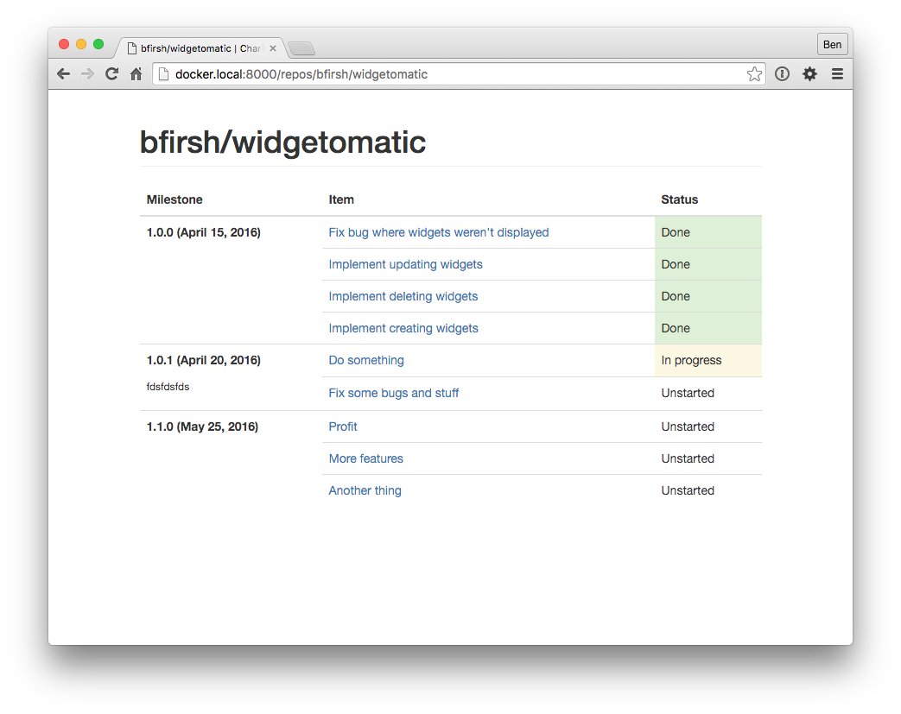

# Charing Cross

Project planning with GitHub issues.



## Running in development

[Register a new GitHub application](https://github.com/settings/applications/new) with these settings:

 * Application name: `Charing Cross Development`
 * Homepage URL: `http://docker.local:8000`
 * Authorization callback URL: `http://docker.local:8000/complete/github-org/`

Save the client ID and client secret into a file called `docker-compose.override.yml`:

```yaml
version: "2"
services:
  web:
    environment:
      GITHUB_KEY: [client id]
      GITHUB_SECRET: [secret]
```

Then run:

    $ docker-compose up db -b
    $ docker-compose run web python manage.py migrate
    $ docker-compose up -d 

## Running in production

`docker-compose.production.yml` is a Docker Cloud stack file.
